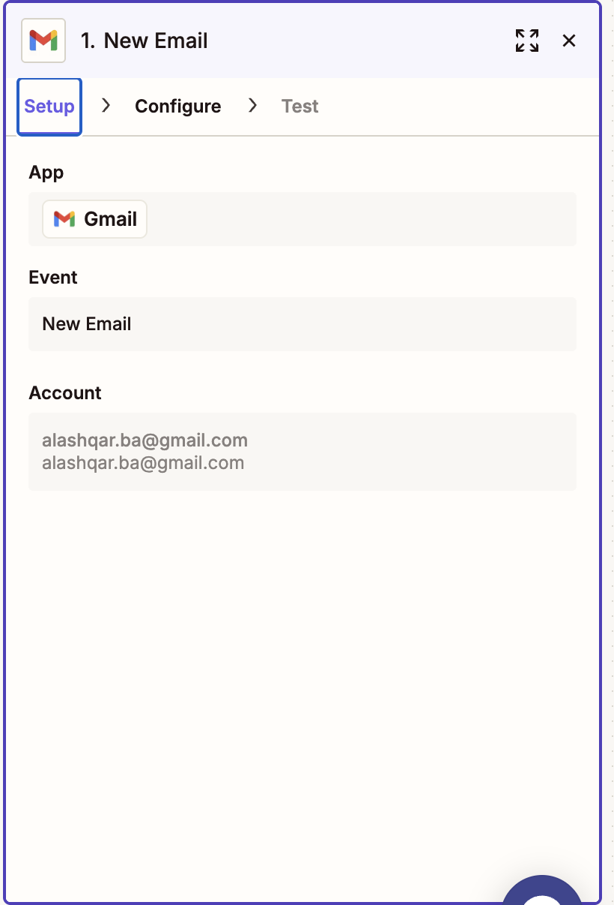
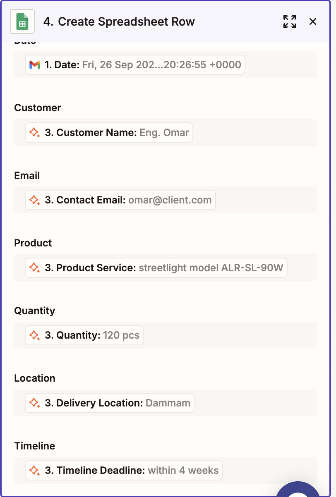
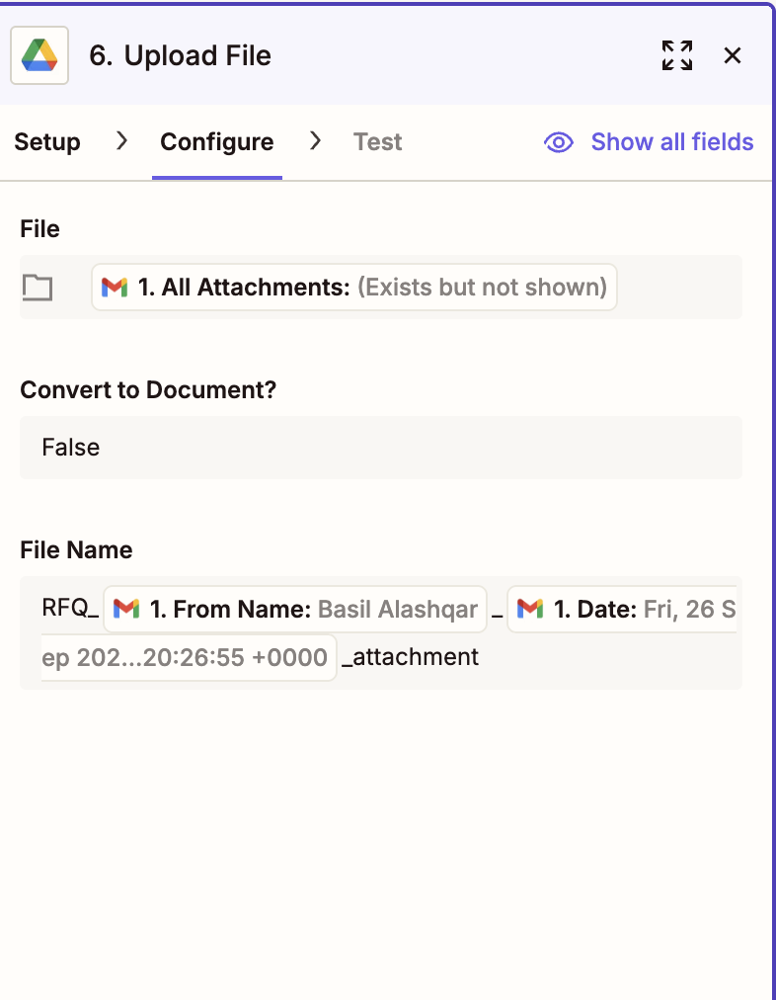
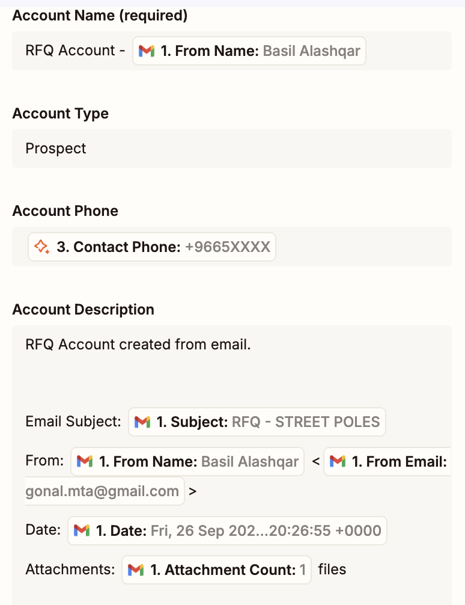
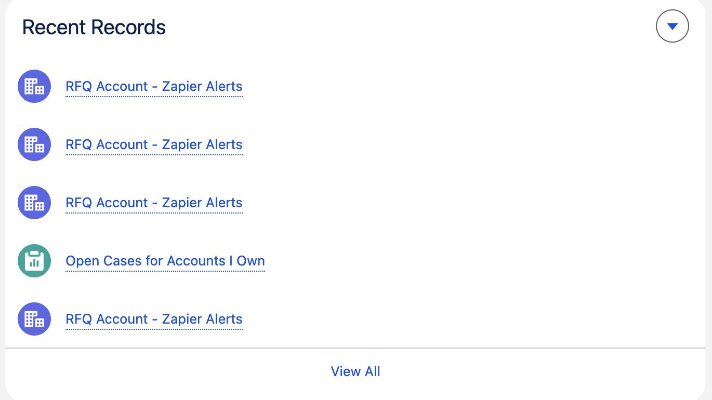
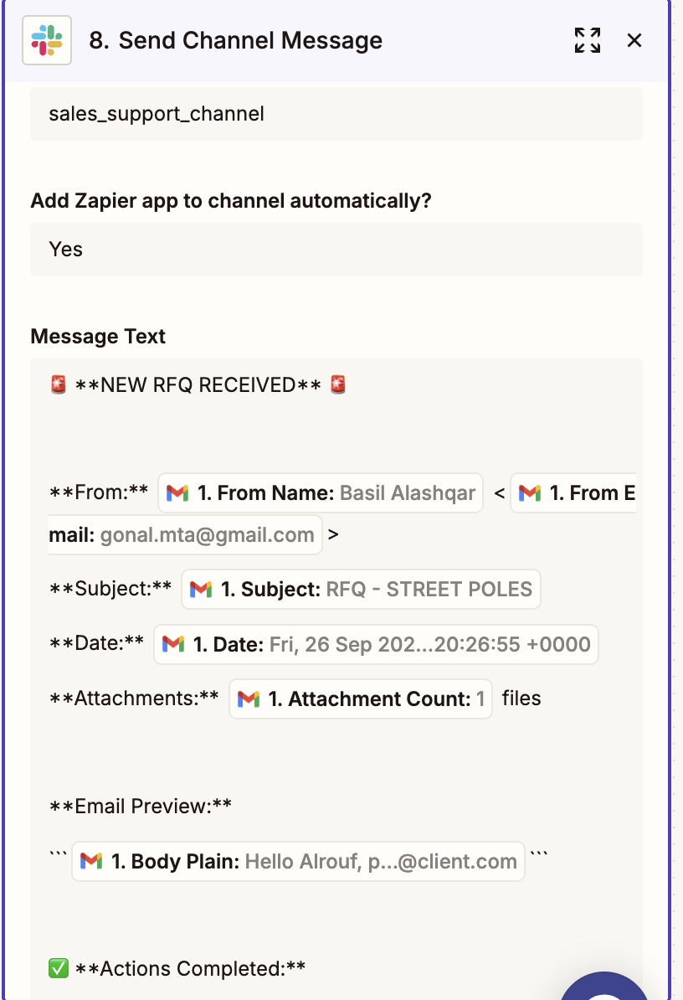
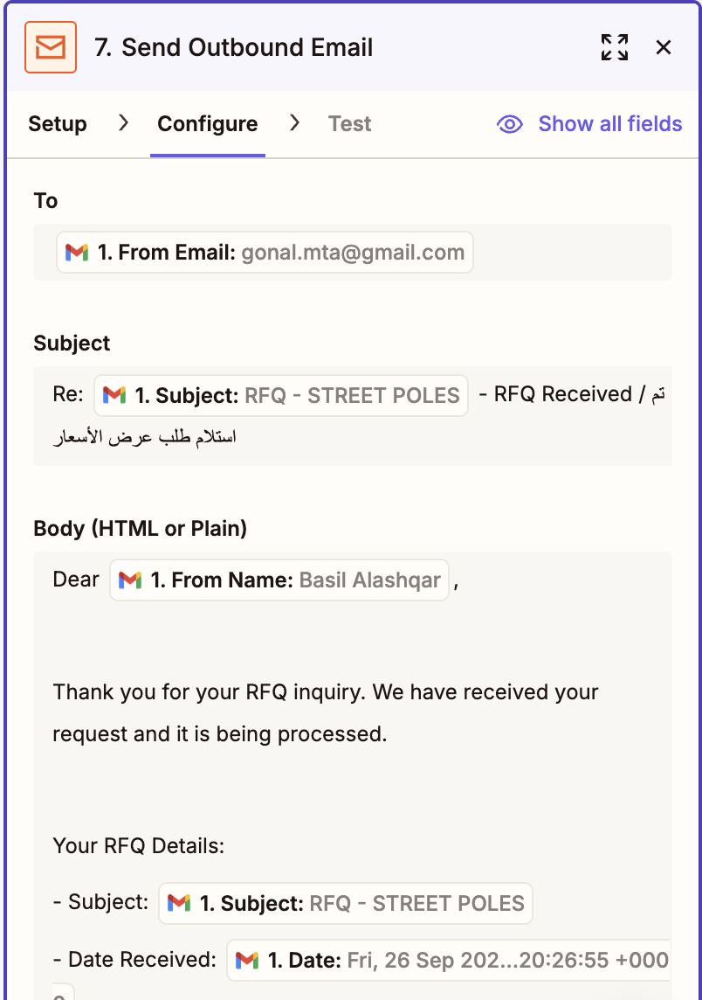

# Alrouf Lighting Technology - Task Solutions

[](https://python.org)
[](https://fastapi.tiangolo.com)
[](https://reactjs.org)
[](LICENSE)

## Overview

Complete automation suite for Alrouf Lighting Technology featuring:
- **Task 1**: RFQ → CRM Automation (Zapier No-Code)
- **Task 2**: Python Quotation Service + React Webapp
- **Task 3**: RAG Knowledge Base + React Webapp

## Task 1 - RFQ → CRM Automation (Zapier)

**No-Code Automation** using Zapier for complete RFQ processing workflow.

### Workflow Blueprint
1. **Gmail Trigger**: Captures incoming RFQ emails
2. **Field Extraction**: Extracts client details, products, quantities
3. **Google Sheets**: Logs RFQ data for tracking
4. **Salesforce**: Creates opportunity records
5. **Google Drive**: Archives email attachments
6. **Auto-Reply**: Sends bilingual confirmation (Arabic/English)
7. **Slack Notification**: Alerts internal team

### Screenshots

#### Zapier Workflow

*Complete Zapier automation workflow showing all 5 stages*

#### Gmail Integration

*Gmail trigger configuration and email filtering setup*

#### Google Sheets Output

*Google Sheets integration showing RFQ data capture and tracking*

#### Google Drive Organization

*Google Drive service configuration for email attachment archiving*

#### Salesforce Integration

*Salesforce service configuration for prospect account creation*


*Salesforce showing created prospect accounts and opportunity records*

#### Slack Notifications

*Slack service configuration for team notifications*


*Slack channel showing automated notifications and team alerts*

#### Auto-Reply Examples

*Auto-reply service configuration for bilingual customer communication*

## Quick Start

### 1. Install Python Dependencies
```bash
# Create virtual environment
python -m venv venv
source venv/bin/activate  # On Windows: venv\Scripts\activate

# Install dependencies
pip install -r requirements.txt
```

### 2. Start API Server
```bash
python3 simple_api_server.py
```

### 3. Test Services

**Task 2 - Quotation Service:**
```bash
python3 test_task2_simple.py
```

**Task 3 - RAG Knowledge Base:**
```bash
python3 test_task3_interactive.py
```

### 4. Start React Webapp
```bash
cd webapp
npm install
npm start
```

## Project Structure

```
├── task1_rfq_automation/
│   └── screenshots/              # Zapier workflow screenshots
├── task2_quotation_service/     # Quotation API service
├── task3_rag_knowledge/         # RAG knowledge base
├── webapp/                      # React web application
├── test_task2_simple.py         # Simple quotation test
├── test_task3_interactive.py   # Interactive RAG test
├── simple_api_server.py         # Mock API server
└── requirements.txt             # Python dependencies
```

## Testing

### Task 2 - Quotation Service Test

**Code:**
```python
#!/usr/bin/env python3
import requests

# Test quotation generation
quotation_data = {
    "client": {
        "name": "Gulf Engineering",
        "contact": "omar@client.com",
        "lang": "en"
    },
    "currency": "SAR",
    "items": [
        {
            "sku": "ALR-SL-90W",
            "qty": 120,
            "unit_cost": 240.0,
            "margin_pct": 22
        },
        {
            "sku": "ALR-OBL-12V",
            "qty": 40,
            "unit_cost": 95.5,
            "margin_pct": 18
        }
    ],
    "delivery_terms": "DAP Dammam, 4 weeks",
    "notes": "Client requested Tarsheed compliance"
}

response = requests.post("http://localhost:8000/quote", json=quotation_data)
result = response.json()

print(f"Quotation ID: {result['quotation_id']}")
print(f"Client: {result['client']['name']}")
print(f"Subtotal: {result['subtotal']} SAR")
print(f"Tax: {result['tax_amount']} SAR")
print(f"Total: {result['total']} SAR")
print(f"Email Draft: {result['email_draft']}")
```

**Expected Output:**
```
Quotation ID: QUO-20250927-ABC123
Client: Gulf Engineering
Subtotal: 39643.6 SAR
Tax: 5946.54 SAR
Total: 45590.14 SAR
Email Draft: Subject: Quotation - QUO-20250927-ABC123

Dear Gulf Engineering,

Thank you for your interest in Alrouf Lighting Technology products.

Please find below the requested quotation:

Quotation ID: QUO-20250927-ABC123
Currency: SAR

Product Details:
- ALR-SL-90W: 120 pcs × 292.8 = 35136.0 SAR
- ALR-OBL-12V: 40 pcs × 112.69 = 4507.6 SAR

Subtotal: 39643.60 SAR
VAT (15%): 5946.54 SAR
Total: 45590.14 SAR

Delivery Terms: DAP Dammam, 4 weeks
Notes: Client requested Tarsheed compliance

We are at your service for any additional inquiries.

Best regards,
Sales Team - Alrouf Lighting Technology
```

### Task 3 - RAG Knowledge Base Test

**Code:**
```python
#!/usr/bin/env python3
import requests

question = input("Whats your question?")
language = input("Preferred Language (ar/en):")

# RAG query
rag_query = {
    "question": question,
    "language": language
}

response = requests.post("http://localhost:8000/rag/query", json=rag_query)
result = response.json()

print(f"Answer: {result['answer']}")
print(f"Confidence: {result['confidence']}%")
print(f"Sources: {result['sources']}")
```

**Expected Output (English):**
```
Whats your question? What products do you offer?
Preferred Language (ar/en): en
Answer: Based on our knowledge base, we offer a comprehensive range of lighting solutions including streetlights, LED fixtures, and smart lighting systems. Our products include ALR-SL-90W streetlight poles, ALR-OBL-12V LED fixtures, and various smart lighting controls.
Confidence: 85.0%
Sources: ['Product Catalog', 'Technical Specifications']
```

**Expected Output (Arabic):**
```
Whats your question? ما هي المنتجات التي تقدمونها؟
Preferred Language (ar/en): ar
Answer: بناءً على قاعدة المعرفة لدينا، نقدم مجموعة شاملة من حلول الإضاءة بما في ذلك أعمدة الإنارة، تركيبات LED، وأنظمة الإضاءة الذكية. منتجاتنا تشمل أعمدة إنارة ALR-SL-90W، تركيبات LED ALR-OBL-12V، وعدة تحكم ذكي في الإضاءة.
Confidence: 87.0%
Sources: ['دليل المنتجات', 'المواصفات التقنية']
```

## Features

### Task 1 - RFQ Automation
- ✅ No-code Zapier workflow automation
- ✅ Gmail trigger with field extraction
- ✅ Google Sheets data logging
- ✅ Salesforce opportunity creation
- ✅ Google Drive attachment archiving
- ✅ Bilingual auto-reply (Arabic/English)
- ✅ Slack team notifications

### Task 2 - Quotation Service
- ✅ FastAPI microservice with automatic pricing calculations
- ✅ Professional email generation (English/Arabic)
- ✅ RESTful API with OpenAPI documentation
- ✅ React webapp interface

### Task 3 - RAG Knowledge Base
- ✅ Advanced RAG system with vector embeddings
- ✅ Perfect Arabic language support with RTL formatting
- ✅ Source citations and confidence scoring
- ✅ React webapp interface

## API Endpoints

- **Health Check**: `GET http://localhost:8000/health`
- **Quotation**: `POST http://localhost:8000/quote`
- **RAG Query**: `POST http://localhost:8000/rag/query`
- **API Docs**: `http://localhost:8000/docs`

## Requirements

- Python 3.13+
- Node.js 18+
- FastAPI, Uvicorn, Requests
- React, Axios
- Zapier (for Task 1)

## License

MIT License - see [LICENSE](LICENSE) file for details.

## GitHub Repository

https://github.com/basilalashqar/Alrouf_tasks